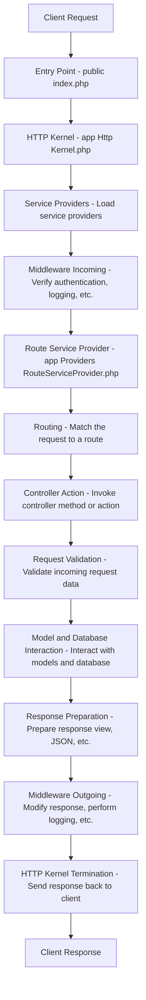
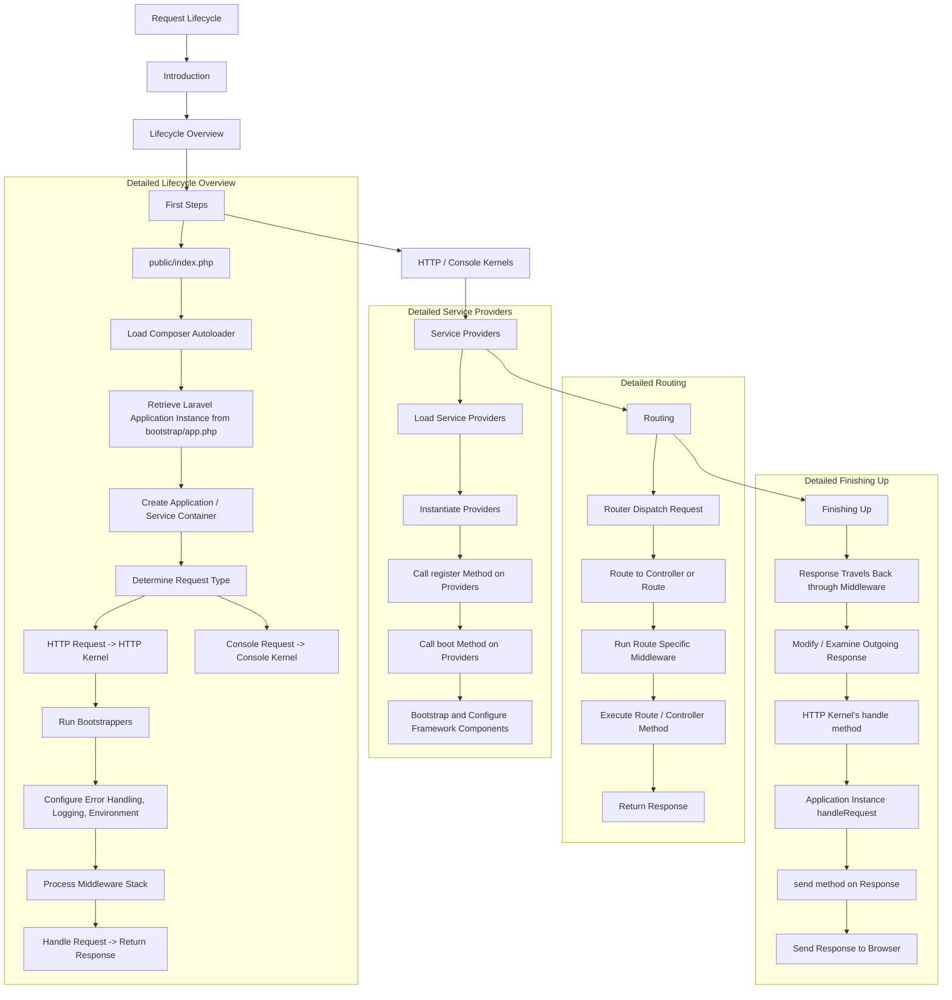
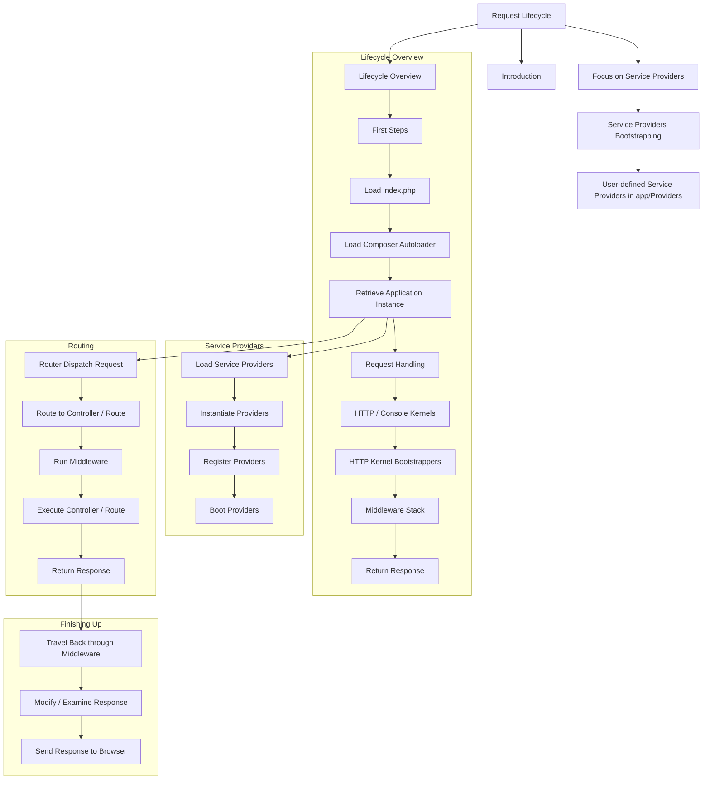

```mermaid
graph TD
    A[Client Request] --> B[Entry Point - public index.php]
    B --> C[HTTP Kernel - app Http Kernel.php]
    C --> D[Service Providers - Load service providers]
    D --> E[Middleware Incoming - Verify authentication, logging, etc.]
    E --> F[Route Service Provider - app Providers RouteServiceProvider.php]
    F --> G[Routing - Match the request to a route]
    G --> H[Controller Action - Invoke controller method or action]
    H --> I[Request Validation - Validate incoming request data]
    I --> J[Model and Database Interaction - Interact with models and database]
    J --> K[Response Preparation - Prepare response view, JSON, etc.]
    K --> L[Middleware Outgoing - Modify response, perform logging, etc.]
    L --> M[HTTP Kernel Termination - Send response back to client]
    M --> N[Client Response]
```

```mermaid
graph TD
    A[Request Lifecycle] --> B[Introduction]
    B --> C[Lifecycle Overview]
    C --> D[First Steps]
    D --> E[HTTP / Console Kernels]
    E --> F[Service Providers]
    F --> G[Routing]
    G --> H[Finishing Up]
    
    subgraph Detailed Lifecycle Overview
        direction TB
        D --> I[public/index.php]
        I --> J[Load Composer Autoloader]
        J --> K[Retrieve Laravel Application Instance from bootstrap/app.php]
        K --> L[Create Application / Service Container]
        L --> M[Determine Request Type]
        M --> N[HTTP Request -> HTTP Kernel]
        M --> O[Console Request -> Console Kernel]
        N --> P[Run Bootstrappers]
        P --> Q[Configure Error Handling, Logging, Environment]
        Q --> R[Process Middleware Stack]
        R --> S[Handle Request -> Return Response]
    end
    
    subgraph Detailed Service Providers
        direction TB
        F --> T[Load Service Providers]
        T --> U[Instantiate Providers]
        U --> V[Call register Method on Providers]
        V --> W[Call boot Method on Providers]
        W --> X[Bootstrap and Configure Framework Components]
    end
    
    subgraph Detailed Routing
        direction TB
        G --> Y[Router Dispatch Request]
        Y --> Z[Route to Controller or Route]
        Z --> AA[Run Route Specific Middleware]
        AA --> AB[Execute Route / Controller Method]
        AB --> AC[Return Response]
    end
    
    subgraph Detailed Finishing Up
        direction TB
        H --> AD[Response Travels Back through Middleware]
        AD --> AE[Modify / Examine Outgoing Response]
        AE --> AF[HTTP Kernel's handle method]
        AF --> AG[Application Instance handleRequest]
        AG --> AH[send method on Response]
        AH --> AI[Send Response to Browser]
    end
```

## One More structure

```mermaid
graph TD
    A[Request Lifecycle]
    A --> B[Introduction]
    A --> C[Lifecycle Overview]
    
    subgraph Lifecycle Overview
        C --> D[First Steps]
        D --> E[Load index.php]
        E --> F[Load Composer Autoloader]
        F --> G[Retrieve Application Instance]
        
        G --> H[Request Handling]
        H --> I[HTTP / Console Kernels]
        I --> J[HTTP Kernel Bootstrappers]
        J --> K[Middleware Stack]
        K --> L[Return Response]
    end
    
    subgraph Service Providers
        G --> M[Load Service Providers]
        M --> N[Instantiate Providers]
        N --> O[Register Providers]
        O --> P[Boot Providers]
    end
    
    subgraph Routing
        G --> Q[Router Dispatch Request]
        Q --> R[Route to Controller / Route]
        R --> S[Run Middleware]
        S --> T[Execute Controller / Route]
        T --> U[Return Response]
    end
    
    subgraph Finishing Up
        U --> V[Travel Back through Middleware]
        V --> W[Modify / Examine Response]
        W --> X[Send Response to Browser]
    end
    
    A --> Y[Focus on Service Providers]
    Y --> Z[Service Providers Bootstrapping]
    Z --> AA[User-defined Service Providers in app/Providers]
```
